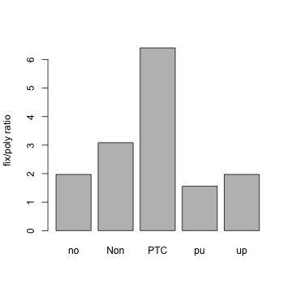
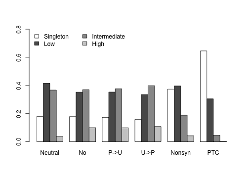
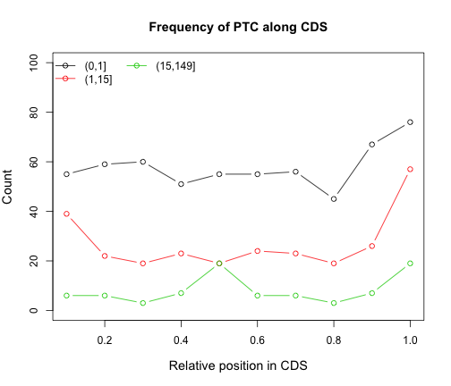
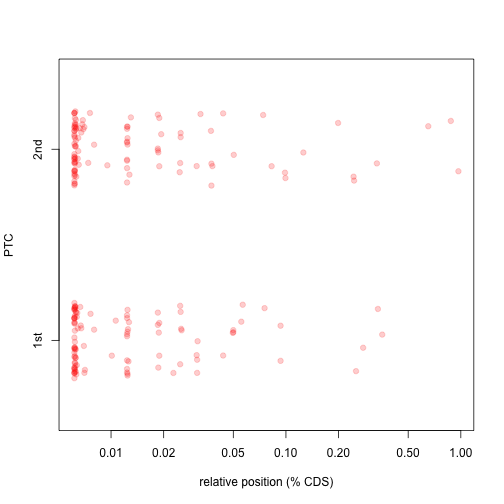
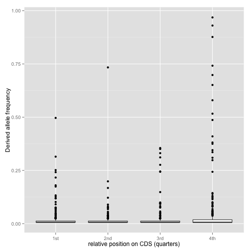

Frequency Spectrum Analysis for PTC vs. Synonymous
========================================================
*Goal of this analysis*
1. Compare the frequency spectrum of PTC variants to that of synonymous (no change or fourfold degenerate sites) or nonsynonymous ones.
2. Evaluate relative positions of PTC variants in CDS

## 1. Read and cleanup data
_Some general stats_
* 11375 genes in total

```r
setwd("~/Documents/work/help_others/Yong_project/Fig_1")
res <- read.table("out1.txt", head = TRUE)
Genes <- read.table("out1.txt.sites", head = TRUE)

# remove cases where both alleles are stop codons -- usually fixed/poly at
# the actual stop codon instead of PTC
stopcodons <- c("TAA", "TAG", "TGA")
stoppairs <- paste(stopcodons[c(1, 1, 2, 2, 3, 3)], stopcodons[c(2, 3, 1, 3, 
    1, 2)], sep = "")
ss <- subset(res, OriMut %in% stoppairs)
res <- subset(res, !OriMut %in% stoppairs)
# further remove loss of stop codon events, focus on gain
ori <- substr(res$OriMut, 1, 3)
ls <- subset(res, ori %in% stopcodons)
res <- subset(res, !ori %in% stopcodons)
```


```r
# a very rough MK test use 15% as empirical cutoff for MAF
mk <- with(subset(res, DAF > total * 0.15), table(polyfix, SynNons)[1:2, ])
barplot(mk[1, ]/mk[2, ], ylab = "fix/poly ratio")
```

 


## 2. Calculate SFS

 

```
## In this plot, NoChg/P->U/U->P all refer to synonymous changes. They are classified by how the substitution affected codon usage. Among them, NoChg is considered closest to neutral. U->P is likely under positive selection...
```

```
## Variants that appear in just one strain, i.e. singletons, are more prone to be sequencing error. For this reason, I showed them as a separate class. Even if we disregard them, it is clear from the plot that PTC variants have a highly skewed frequency spectrum compared to all the other classes, with an excess of low frequency ones...
```


## 3. SFS test

```r
myTheta <- function(sfs1) {
    n <- length(sfs1) + 1
    n1 <- n - 1
    S <- sum(sfs1)
    theta.w <- S/sum(1/1:n1)
    theta.pi <- sum(1:n1 * n1:1 * sfs1)/choose(n, 2)
    theta1 <- sfs1[1]
    theta.h <- sum(1:n1 * 1:n1 * sfs1)/choose(n, 2)
    return(list(theta.w = theta.w, theta.pi = theta.pi, theta1 = theta1, theta.h = theta.h))
}
mySFStest <- function(sfs1, divide, sfs2 = NULL) {
    ## INPUT: a vector of frequency spectrums, length = n-1 frequency class from
    ## 1 ~ n-1, counts divide is a percentage (0,1) which groups the sites into
    ## two classes DO : calculate various theta estimators and do several tests
    ## based on these estimators, following ZK's work OUTPUT: to be determined
    
    ## calculate different estimators of theta
    n <- length(sfs1) + 1
    n1 <- n - 1
    S <- sum(sfs1)
    theta.w <- S/sum(1/1:n1)
    theta.pi <- sum(1:n1 * n1:1 * sfs1)/choose(n, 2)
    theta1 <- sfs1[1]
    theta.h <- sum(1:n1 * 1:n1 * sfs1)/choose(n, 2)
    
    ## Calculate Tajima's D
    d <- theta.pi - theta.w
    a1 = sum(1/1:n1)
    b1 = (n + 1)/(3 * (n - 1))
    c1 = b1 - 1/a1
    e1 = c1/a1
    a2 = sum(1/(1:n1)^2)
    b2 = 2 * (n^2 + n + 3)/(9 * n * (n - 1))
    c2 = b2 - (n + 2)/a1/n + a2/(a1^2)
    e2 = c2/(a1^2 + a2)
    vd.hat <- e1 * S + e2 * S * (S - 1)
    D <- d/sqrt(vd.hat)
    
    ## 2. divide the counts into two categories according to 'divide'
    j <- trunc(n * divide)
    obs <- c(sum(sfs1[1:j]), sum(sfs1[-(1:j)]))  # groups: 1:j and j:n1
    if (is.null(sfs2)) {
        sfs0 <- 1/1:n1  ## sfs under neutral model
        exp.p <- c(sum(sfs0[1:j]), sum(sfs0[-(1:j)]))/sum(sfs0)
        if (sum(obs < 5)) 
            chisq <- chisq.test(obs, p = exp.p, simulate = TRUE, B = 10000) else chisq <- chisq.test(obs, p = exp.p, simulate = FALSE)
        ## 4. likelihood ratio
        L0 = dbinom(obs[1], size = sum(obs), prob = exp.p[1])
        L1 = dbinom(obs[1], size = sum(obs), prob = obs[1]/sum(obs))
        LR = L0/L1
    } else {
        obs2 <- c(sum(sfs2[1:j]), sum(sfs2[-(1:j)]))  # groups: 1:j and j:n1
        exp.p <- obs2/sum(obs2)
        if (sum(obs) < 5 | sum(obs2) < 5) 
            chisq <- chisq.test(obs, p = exp.p, simulate = TRUE, B = 10000) else chisq <- chisq.test(obs, p = exp.p, simulate = FALSE)
        ## 4. likelihood ratio
        L0 = dbinom(obs[1], size = sum(obs), prob = obs2[1]/sum(obs2))
        L1 = dbinom(obs[1], size = sum(obs), prob = obs[1]/sum(obs))
        LR = L0/L1
    }
    
    
    result <- list(table = matrix(c(obs, round(obs/sum(obs), 2), chisq$exp, 
        round(chisq$exp/sum(chisq$exp), 2)), ncol = 4, dimnames = list(c(paste("<", 
        divide, sep = ""), paste(">=", divide, sep = "")), c("obs", "obs%", 
        "exp", "exp%"))), chisq.stat = chisq$stat, chisq.pvalue = chisq$p.value, 
        Likelihood.rtio = LR, Tajima.D = D)
    return(result)
}
mySFStest1 <- function(sfs1, neut = NULL) {
    ## a simple categorical X^2 test 1. divide the polymorphism counts into three
    ## categories of roughtly equal size
    n1 <- length(sfs1)
    n <- n1 + 1
    if (is.null(neut)) {
        neut <- 1/1:n1  ## neutral spectrum
    }
    cum.neut <- cumsum(neut)
    cum <- max(cum.neut)
    cut1 <- c(which.min(abs(cum.neut - cum/3)), which.min(abs(cum.neut - cum * 
        2/3)))
    category <- as.factor(c(rep("low", cut1[1]), rep("intermediate", cut1[2] - 
        cut1[1]), rep("high", n1 - cut1[2])))
    obs <- by(sfs1, category, sum)
    exp <- by(neut, category, sum)
    if (sum(obs < 5)) 
        simulate1 = TRUE else simulate1 = FALSE
    barplot(rbind(obs, exp = exp/sum(exp) * sum(obs))[, 3:1], beside = TRUE, 
        legend.text = TRUE)
    return(chisq.test(obs, p = exp/sum(exp), simulate = simulate1))
}
tajima.d <- apply(SFS[, -6], 2, function(x) mySFStest(x, 0.15)$Tajima)
```


## 4. Pi for Syn and PTC

```r
## calculate total number of fourfold degenerate sites or one-step to PTC
## sites
L <- c(fourfold = sum(Genes$X4fold), nonsyn = sum(Genes$Non), onestep = sum(Genes$OneStep))
## estimate theta.pi
sfs$fourfold <- subset(res, polyfix == "poly" & X4fold == 1 & SynNons %in% c("pu", 
    "up", "no"), c("DAF", "total"))
SFS$fourfold <- mySample(sfs$fourfold, 150)
theta.pi <- c(fourfold = myTheta(SFS$fourfold)$theta.pi, nonsyn = myTheta(SFS$NON)$theta.pi, 
    PTC = myTheta(SFS$PTC)$theta.pi)
theta.pi.per.site <- theta.pi/L
```


## 5. Relative position of PTC


```r
rPos.hist <- rbind(hist(subset(ptc1, rDAF == 1)$rPos, plot = FALSE)$counts, 
    hist(subset(ptc1, rDAF > 1 & rDAF <= 15)$rPos, plot = FALSE)$counts, hist(subset(ptc1, 
        rDAF > 15)$rPos, plot = FALSE)$counts)
plot(seq(0.1, 1, 0.1), rPos.hist[1, ], type = "b", ylim = c(0, 100), cex.lab = 1.2, 
    xlab = "Relative position in CDS", ylab = "Count", main = "Frequency of PTC along CDS")
lines(seq(0.1, 1, 0.1), rPos.hist[2, ], type = "b", col = 2)
lines(seq(0.1, 1, 0.1), rPos.hist[3, ], type = "b", col = 3)
legend("topleft", pch = 1, lty = 1, col = 1:3, legend = c("(0,1]", "(1,15]", 
    "(15,149]"), bty = "n", ncol = 2)
```

 

*Notice how the intermediate/high frequency PTC show a 'bump' in the middle of the CDS...*


```
## Distribution of # of PTC variants per gene..
```

```
## 
##   1   2   3   4   5   6 
## 774  83  13   6   1   1
```

```
## In genes with multiple PTC, is there a correlation between the order and the DAF of the PTC SNPs?
```

```
## Difference is not obvious / significant...
```

```
## Loading required package: ggplot2
```

  


